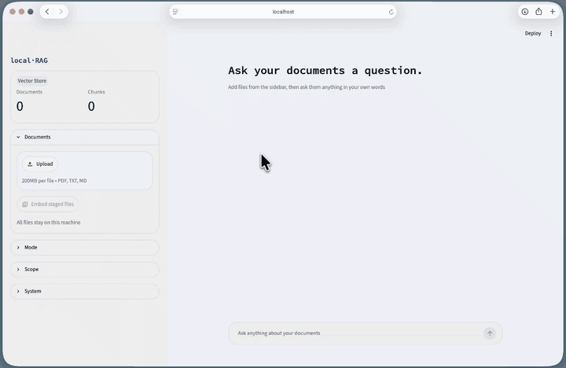

> [!WARNING]
> Only tested on mac so far.

# <p align="center">local-RAG</p>

<p align="center">
  LLMs know a lot, just not what's in your documents.<br>
  Either they can't see them, or you have to upload them to someone else's server.
  <br><br>
  local-RAG lets you chat with your documents without that tradeoff.<br>
  Drop in your PDFs or notes, ask a question, and an LLM answers based only on the info you gave it.<br>
  <br>
  No made-up answers, no cloud, no account, just a simple web app that runs completely on your own machine.
</p>

<p align="center"></p>

## Features

- **Upload & ask**: drop in `.pdf`, `.txt` or `.md`, then ask anything about them
- **4 retrieval modes**: switch between them right in the sidebar, to get the best one for each use case
- **Pick a scope**: choose which docs get searched
- **Answers with sources**: every answer shows which file and page it came from

## How it works

1. **Upload**: your files get split into small chunks and stored in a local vector database
2. **Ask**: your question is used to search those chunks. How exactly depends on the retrieval mode
3. **Answer**: the best matching chunks go to a local LLM, which answers based on the info in them

## Retrieval modes

| Mode | What it does | Good for |
|---|---|---|
| `semantic` | plain vector similarity search in Chroma | questions phrased differently than the docs |
| `lexical` | BM25 keyword search | exact wording like model numbers or error codes |
| `hybrid` | both of the above, merged with Reciprocal Rank Fusion | mixed questions, solid default |
| `hybrid_rerank` | hybrid grabs 20 candidates, a cross-encoder rescores them, best k go to the LLM | when the top hit really has to be right |

## Evaluation

Having 4 modes is nice, but how do they perform? To find out, I built a small eval pipeline that runs every mode on the same set of questions and checks where the correct chunk ends up.

29 questions over 5 docs (3 PDFs, 1 txt, 1 md). Corpus and questions were generated with Claude.

- **Recall@k**: the share of questions where a correct chunk was somewhere in the top k retrieved chunks
- **MRR@k**: from the top k retrieved chunks, what rank was the first correct one. Rank 1 gives 1, rank 2 gives 0.5, rank 3 gives 0.33, not in the top k gives 0. Averaged over all questions

|  | R@1 | R@3 | R@5 | MRR@1 | MRR@3 | MRR@5 |
|---|---|---|---|---|---|---|
| semantic | 0.759 | 0.897 | 0.966 | 0.759 | 0.822 | 0.836 |
| lexical | 0.759 | 0.966 | **1.000** | 0.759 | 0.862 | 0.869 |
| hybrid | 0.793 | **1.000** | **1.000** | 0.793 | 0.891 | 0.891 |
| hybrid_rerank | **0.897** | 0.966 | 0.966 | **0.897** | **0.931** | **0.931** |

Takeaways:
- hybrid finds the right chunk more reliably than either search alone
- reranking pushes it to rank 1 way more often (0.79 → 0.90 at R@1 vs. plain hybrid). Matters, since the LLM only gets the top few chunks as context
- lexical beating semantic on recall makes sense here, the docs are full of product names and codes

## Setup

**Prerequisites:** [Ollama](https://ollama.com) and Docker, both running on your machine.

Ollama runs natively on your machine, not in Docker. Docker on Mac has no GPU access, so it'd be way slower. The app container reaches it via `host.docker.internal`.

```bash
git clone https://github.com/t-ecker/local-RAG.git
cd local-RAG
make setup    # creates .env, pulls the Ollama models (run on your machine, not in the devcontainer)
```

Models are set in `.env`. Defaults: `qwen3.5:4b` for chat, `nomic-embed-text:v1.5` for embeddings, `cross-encoder/ms-marco-MiniLM-L6-v2` for reranking.

**Run it:**

```bash
make build
make up       # → http://localhost:8501
```

Run `make` to see all targets, incl. `dev` and `eval` for working inside the devcontainer.

## Possible extensions

- URL loader for websites
- OCR / table extraction for scanned or table-heavy PDFs
- a bigger, hand-written eval set with trickier questions
- for real production I'd split it into a FastAPI backend + separate frontend. Streamlit is great for a prototype, not much beyond that

## Sources

- https://stackoverflow.com/questions/78689283/exposing-11434-port-in-docker-container-to-access-ollama-local-model
- https://docs.langchain.com/oss/python/deepagents/retrieval
- https://docs.langchain.com/oss/python/langchain/knowledge-base
- https://docs.langchain.com/oss/python/integrations/vectorstores/chroma
- https://docs.langchain.com/oss/python/integrations/chat/ollama
- https://medium.com/@connect.hashblock/streamlit-vs-gradio-why-i-chose-streamlit-for-my-ml-apps-d540b2d758bc
- https://docs.streamlit.io
- https://docs.streamlit.io/develop/tutorials/chat-and-llm-apps/build-conversational-apps
- https://medium.com/@rajnish_khatri/retrieval-metrics-tutorial-recall-k-and-mrr-explained-d2f12afb9c89
- https://medium.com/@alexrodriguesj/hybrid-search-rag-revolutionizing-information-retrieval-9905d3437cdd
- https://github.com/xhluca/bm25s
- https://medium.com/@devalshah1619/mathematical-intuition-behind-reciprocal-rank-fusion-rrf-explained-in-2-mins-002df0cc5e2a
- https://huggingface.co/cross-encoder/ms-marco-MiniLM-L6-v2
- https://sbert.net/docs/package_reference/cross_encoder/model.html#sentence_transformers.cross_encoder.CrossEncoder.rank
- https://stackoverflow.com/questions/66683480/why-does-documentation-use-lru-cache-decorated-function-to-get-settings-instead
- https://docs.python.org/3/library/functools.html#functools.cache
- https://huggingface.co/docs/huggingface_hub/package_reference/environment_variables
